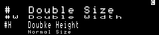

# Marktel syntax reference

# Headings

```
#  Double Size
#W Double Width
#H Doubke Height
   Normal Size
```

Renders to :


## Paragraphs

For paragraph, just write normal text

```
Lorem ipsum dolor sit amet, graecis denique ei vel, at duo primis mandamus.
```

Renders to :


## Horizontal Rule

To create a thematic break, you can use : `---`

Renders to :


## Special effects

### Blink

The following snippet `** **`, render blinking text.

```
**Rendered as blinking text**
```

render to :


### Underline

The following snippet `_ _`, render underlineed text.

```
_Rendered as underlined text_
```

render to :


### Invert text

The following snippet `~~ ~~`, render inverted text.

```
~~Rendered as inverted text~~
```

render to :


## Lists

### Unordered

A list of items in which the order of the items does not explicitly matter.

```
- Lorem ipsum dolor sit amet.
- Consectetur adipiscing elit.
  - Integer molestie lorem at massa.
  - Facilisis in pretium nisl aliquet.
```

render to :


### Ordered

A list of items in which the order of items does explicitly matter.

```
1. Lorem ipsum dolor sit amet.
2. Consectetur adipiscing elit.
3. Integer molestie lorem at massa.
4. Facilisis in pretium nisl aliquet.
```

render to :


